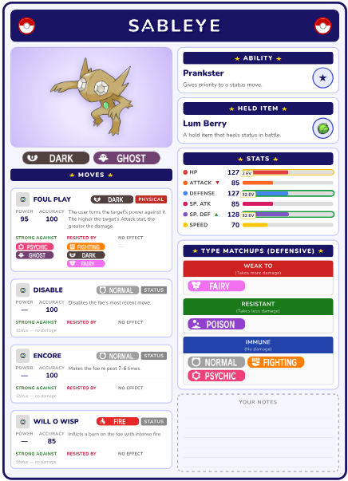
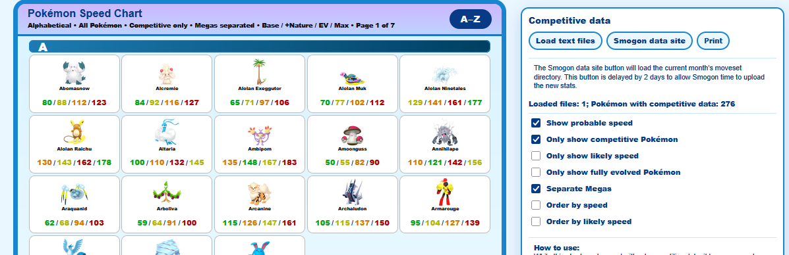
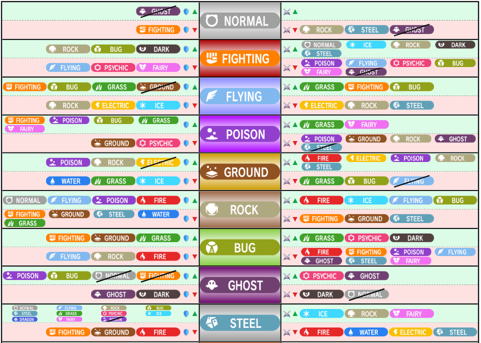

# Pokémon Competitive Tools
Lightweight browser-based tools for competitive Pokémon play and quick reference.
> Click the tool names below to open them, or download the files to use offline.

## Live Tools
- [Card Builder](https://dhak0s.github.io/pokemon-tools/card-builder/card-builder.html)
- [Speed Chart](https://dhak0s.github.io/pokemon-tools/speed-chart/speed-chart.html)
- [Type Chart](https://dhak0s.github.io/pokemon-tools/type-chart/type-chart.html)

## [Card Builder](https://dhak0s.github.io/pokemon-tools/card-builder/card-builder.html)
Build and print a reference card for any Pokémon.
- Paste a Showdown export directly into the name field to auto-fill the whole card
- Manually edit moves, ability, held item, EVs, stats, and nature
- Click the artwork to toggle shiny form
- Use Tab to move through every field in order

## [Speed Chart](https://dhak0s.github.io/pokemon-tools/speed-chart/speed-chart.html)
Visual speed tier reference for VGC.
- Load Smogon moveset files to highlight the most likely speed spreads based on real competitive usage
- One-click load of the latest Regulation VGC data from Smogon's stats site
- Filter by usage tier, toggle modifiers, and sort by speed or likely competitive speed
- Designed to print on a single A4 page for quick in-game reference

## [Type Chart](https://dhak0s.github.io/pokemon-tools/type-chart/type-chart.html)
Printable type effectiveness reference.
- Shows offensive and defensive matchups for all 18 types
- Fits cleanly on a single A4 page
- Download the pdf directly [here](https://dhak0s.github.io/pokemon-tools/type-chart/Pokémon-type-matchup-chart.pdf)

## Data Sources

- [PokeAPI](https://pokeapi.co/) — Pokémon data (stats, moves, abilities, items, images)
- [Smogon](https://www.smogon.com/) — competitive movesets and usage data
- [Pokémon Showdown](https://pokemonshowdown.com/) — set format compatibility

---

Fan-made tools. Not affiliated with Nintendo, Game Freak, or The Pokémon Company.